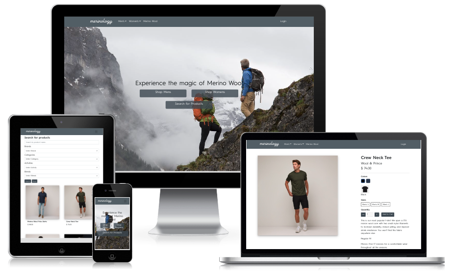
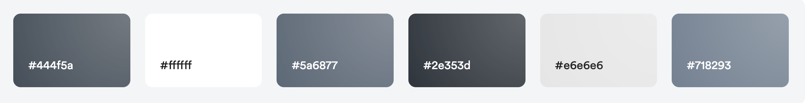

# Merinology

The live demo of the main customer website can be accessed [here](https://tgc-ec-merinology-react.netlify.app/)

The live demo of the admin website can be accessed [here](https://tgc-ec-merinology.herokuapp.com/)

The github for the Express application can be accessed [here](https://github.com/Koihcire/tgc-project3-api)

## 1. Project Summary

### Project Context

### Organisation Goals

### Target Audience

## 2. UI UX

### 2.1 Strategy

#### Organisation Objective

#### User Story

#### User Goals

### 2.2 Scope

#### Features

#### Content

#### Non Functional Requirements

### 2.3 Database and Website Architecture

#### Database

[Click to view logical schema](src/images/logical-schema.png)

#### Website

[Click to view website architecture](src/images/project3-sitemap.pdf)

### 2.4 UI Skeleton

[Click to view UI wireframe](src/images/project3-wireframe.pdf)

### 2.5 Surface

#### Colors

The color chosen is in a greyscale palette in line with a minimalist look and feel. Merino wool apparel are often in natural wool colors in greyscale tones as it is often not ideal to dye the fabric without affecting its natural anti bacterial properties.

#### Fonts
Vanillate font is chosen for the company logo for its clean, bold cursive for a casual, stylish and clean look.

HurmeGeometric font 3 is chosen for the website body for its versatility and suitability for fashion e-commerce websites.

#### Icons
All interface icons are taken from Bootstrap Icons. See credits.

## 3. Features

### Key Features

### Limitations and Future Implementations
<table>
    <tr>
        <th>No.</th>
        <th>Limitations</th>
        <th>Future Implementations</th>
    </tr>
    <tr>
        <td>1</td>
        <td>-</td>
        <td>-</td>
    </tr>
</table>

## 4. Test Cases

[Click for test cases](https://1drv.ms/x/s!ArFMW1hSgH5_gacWUup7Crrz-ORTaA?e=2lzszq)

## 5. Deployment

The express server is deployed using Heroku

The website is manually deployed using Netlify

## 6. Technologies Used

### Backend
<table>
    <tr>
        <th>Technology</th>
        <th>Uses</th>
    </tr>
    <tr>
        <td>Express</td>
        <td>Web application framework used</td>
    </tr>
    <tr>
        <td>Bookshelf.js</td>
        <td>Javascript ORM used for querying SQL databases</td>
    </tr>
    <tr>
        <td>knex</td>
        <td>Query builder for PostgreSQL, MySQL</td>
    </tr>
    <tr>
        <td>db-migrate</td>
        <td>Database migration framework</td>
    </tr>
    <tr>
        <td>Axios</td>
        <td>HTTP client</td>
    </tr>
    <tr>
        <td>Caolan forms</td>
        <td>Create and validate forms</td>
    </tr>
    <tr>
        <td>CORS</td>
        <td>Middleware to enable Cross-Origin Resource Sharing(CORS)</td>
    </tr>
    <tr>
        <td>csurf</td>
        <td>CSRF protection middleware</td>
    </tr>
    <tr>
        <td>dotenv</td>
        <td>To allow loading of environment variables from .env file</td>
    </tr>
    <tr>
        <td>express-sessions</td>
        <td>Session management middleware</td>
    </tr>
    <tr>
        <td>connect-flash</td>
        <td>Middleware to enable flash messages</td>
    </tr>
    <tr>
        <td>express-flash</td>
        <td>Extension of connect-flash to enable definition and rendering of flash messages without redirecting request</td>
    </tr>
    <tr>
        <td>JSON Web Token</td>
        <td>Authentication framework with React app</td>
    </tr>
    <tr>
        <td>Handlebars</td>
        <td>HTML templates for admin panel</td>
    </tr>
    <tr>
        <td>handlebars-helpers</td>
        <td>Handlebar-helpers</td>
    </tr>
    <tr>
        <td>wax-on</td>
        <td>Add support to Handlebars for template inheritance with block and extend helpers</td>
    </tr>
    <tr>
        <td>Cloudinary</td>
        <td>Image hosting service used for upload and storage of images</td>
    </tr>
</table>

### Frontend
<table>
    <tr>
        <th>Technology</th>
        <th>Uses</th>
    </tr>
    <tr>
        <td>React</td>
        <td>Frontend framework</td>
    </tr>
    <tr>
        <td>React router dom</td>
        <td>Handle routing in React web application</td>
    </tr>
    <tr>
        <td>Axios</td>
        <td>HTTP client</td>
    </tr>
    <tr>
        <td>React Bootstrap</td>
        <td>Bootstrap for react client</td>
    </tr><tr>
        <td>Bootstrap</td>
        <td>User for styling of web application</td>
    </tr><tr>
        <td>Stripe</td>
        <td>Pyament gateway used in web application</td>
    </tr>
</table>

## 7. Credits
Interface icons from [Bootstrap icons](https://icons.getbootstrap.com/)

Color paletter from [Muzli](https://colors.muz.li/palette/e8f5fd/d0ecfb/a4b5da/4a6eb5/283c63)

Responsive device mockups from [Create Mockup](https://www.createmockup.com/generate/)

HurmeGeometric font taken from [bestfonts](https://en.bestfonts.pro/font/hurme-geometric-sans-no.3)

Vanillate font taken from [fontspace](https://www.fontspace.com/vanillate-font-f30107)

Stripe.js component is adapted from [Jerrysuper123](https://github.com/Jerrysuper123/artisanBread)

mySQL template for express application is from [kunxin-chor](https://github.com/kunxin-chor/mysql-base)

Product images taken from [Ridge Merino](https://www.ridgemerino.com/), [Wool & Prince](https://woolandprince.com/), [IceBreaker Merino](https://www.icebreaker.com/en-us/home)

Loading skeleton taken from [React-loading-skeleton](https://www.npmjs.com/package/react-loading-skeleton)

